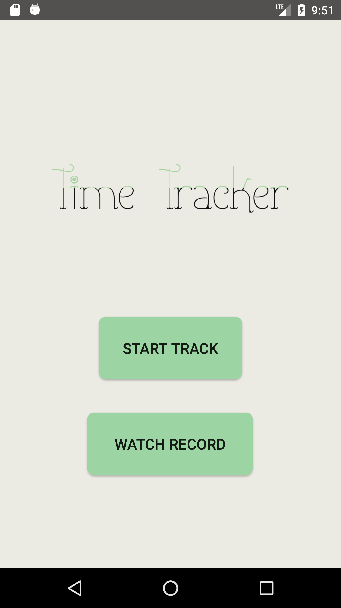
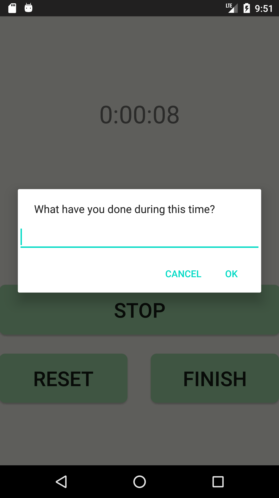
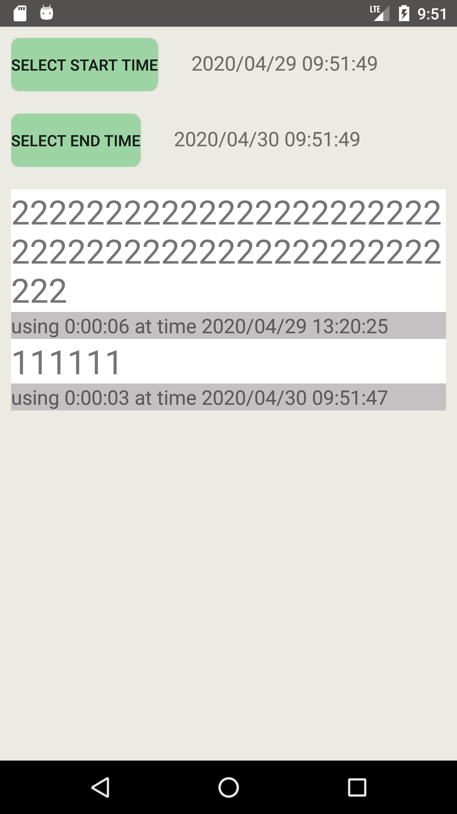

This application named "Time Tracker" is intended to track how many time you spend on kinds of work everyday. This is the final project of the course ["Build Your First Android App"](https://www.coursera.org/learn/android-app?) in coursera. 

There are also some notes of this course(with Chinese) in the file ["课程笔记.md"](./课程笔记.md)

Here's some screenshots of this APP.

TO DO LIST:
* Add statistical chart of records.
* When the user saves the record, provide some alternative options(including history record) for easier selection.
